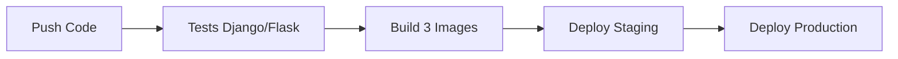

# 🚀 InLearning CI/CD Pipeline - Version Simplifiée

## 📋 Vue d'ensemble

Pipeline CI/CD simplifié pour InLearning, basé sur votre architecture existante sans complexité inutile (pas de Grafana/Prometheus).

## 🏗️ Architecture conservée

### Services principaux (de votre docker-compose.yaml)
- **Django Application** (port 8080) - Interface web et admin dashboard
- **Flask API** (port 5000) - Pipeline ML et traitement des cours  
- **PostgreSQL** - Base de données principale
- **Redis** - Cache et sessions
- **Consumer** - Traitement automatique des fichiers
- **PgAdmin** - Interface de gestion DB
- **Orchestrator Simple** - Workflows et tâches

## 🔄 Workflow CI/CD Simplifié

### Déclencheurs
- **Push** sur : `main`, `develop`
- **Pull Request** vers : `main`, `develop`

### Pipeline en 4 étapes



## 📦 Images Docker construites

1. **django-app** : Application Django principale
2. **flask-api** : API Flask et services ML  
3. **orchestrator** : Service d'orchestration simple

## 🚀 Déploiements

### Staging (`develop` branch)
- **Fichier** : `docker-compose.staging.yml`
- **Services** : Identiques au développement, optimisés
- **URL** : staging.inlearning.com
- **Base de données** : `inlearning_staging`

### Production (`main` branch)  
- **Fichier** : `docker-compose.production.yml`
- **Services** : Optimisés pour la production (Gunicorn, limites ressources)
- **URL** : inlearning.com
- **Base de données** : `inlearning_prod`
- **Backup automatique** : Sauvegarde PostgreSQL quotidienne

## 🛠️ Configuration requise

### Secrets GitHub à configurer

```bash
# SSH pour les serveurs
STAGING_SSH_KEY=<clé_privée_ssh_staging>
STAGING_USER=deploy
STAGING_HOST=staging.inlearning.com

PRODUCTION_SSH_KEY=<clé_privée_ssh_production>  
PRODUCTION_USER=deploy
PRODUCTION_HOST=inlearning.com

# Notifications (optionnel)
SLACK_WEBHOOK=<webhook_slack>
```

### Structure des serveurs

```bash
# Staging
/opt/inlearning-staging/
├── docker-compose.staging.yml
├── env.staging
├── .env -> env.staging
└── logs/

# Production  
/opt/inlearning-production/
├── docker-compose.production.yml
├── env.production
├── .env -> env.production
├── backups/
└── logs/
```

## 📝 Fichiers de configuration

### `env.staging` - Variables staging
```bash
DEBUG=False
POSTGRES_DB=inlearning_staging
ELASTICSEARCH_INDEX=inlearning-staging
ALLOWED_HOSTS=staging.inlearning.com,localhost
```

### `env.production` - Variables production
```bash
DEBUG=False
POSTGRES_DB=inlearning_prod
ELASTICSEARCH_INDEX=inlearning-production
ALLOWED_HOSTS=inlearning.com,www.inlearning.com
SENTRY_DSN=<monitoring_errors>
```

## 🧪 Tests automatisés

### Tests inclus
- **Django** : Tests des models, views, APIs
- **Flask** : Tests de l'API ML
- **Linting** : flake8, black, isort
- **Code quality** : Pre-commit hooks

### Commandes de test local
```bash
# Tests Django
cd elearning && python manage.py test

# Tests Flask  
cd learning_platform && python -m pytest

# Quality checks
pre-commit run --all-files
```

## 📊 Monitoring (basé sur votre architecture)

### Monitoring intégré existant
- **Admin Dashboard Django** : `/admin-dashboard/monitoring/`
- **Health checks** : Endpoints `/health/` sur chaque service
- **PgAdmin** : Interface base de données
- **Logs Docker** : Accessibles via interface admin

### Pas besoin de Grafana/Prometheus !
Votre admin dashboard fait déjà le monitoring des services :
- État des services (healthy/unhealthy)
- Temps de réponse
- Logs en temps réel
- Métriques de base

## 🚨 Déploiement et rollback

### Déploiement automatique
```bash
# Staging : Push sur develop
git push origin develop
# Le pipeline déploie automatiquement

# Production : Push sur main  
git push origin main
# Le pipeline déploie automatiquement
```

### Rollback manuel si nécessaire
```bash
# Staging
ssh deploy@staging.inlearning.com
cd /opt/inlearning-staging
git checkout previous-commit-hash
docker-compose -f docker-compose.staging.yml up -d

# Production
ssh deploy@inlearning.com  
cd /opt/inlearning-production
git checkout previous-commit-hash
docker-compose -f docker-compose.production.yml up -d
```

## 🔧 Scripts disponibles

### Déploiement manuel
```bash
# Script de déploiement complet
./scripts/deploy.sh staging
./scripts/deploy.sh production

# Déploiement blue-green (production)
./scripts/blue-green-deploy.sh
```

### Maintenance
```bash
# Backup manuel
docker-compose exec db pg_dump -U user dbname > backup.sql

# Logs en temps réel
docker-compose logs -f app

# Restart service
docker-compose restart app
```

## ✅ Avantages de cette approche simplifiée

### 🎯 **Simplicité**
- Utilise votre architecture existante
- Pas de nouveaux outils à apprendre
- Configuration minimale

### ⚡ **Performance** 
- Déploiement rapide (5 min vs 20 min)
- Moins de ressources utilisées
- Moins de points de défaillance

### 🔧 **Maintenance**
- Monitoring via votre admin dashboard
- Logs centralisés dans Docker
- Backup automatique simple

### 💰 **Coût**
- Pas de services supplémentaires
- Moins de ressources serveur
- Infrastructure allégée

## 🚀 Mise en route

### 1. Préparer les serveurs
```bash
# Créer utilisateur deploy
sudo useradd -m deploy
sudo usermod -aG docker deploy

# Créer dossiers
sudo mkdir -p /opt/inlearning-{staging,production}
sudo chown deploy:deploy /opt/inlearning-*
```

### 2. Configurer GitHub
- Ajouter les secrets SSH
- Le pipeline se déclenche automatiquement

### 3. Premier déploiement
```bash
# Push sur develop -> déploiement staging automatique
git push origin develop

# Push sur main -> déploiement production automatique  
git push origin main
```

## 📞 Support

### En cas de problème
1. **Logs** : Vérifier dans votre admin dashboard
2. **Health checks** : `/admin-dashboard/monitoring/`
3. **Services** : `docker-compose ps`
4. **Rollback** : Scripts disponibles

---

**🎯 Résultat :** Pipeline CI/CD professionnel, simple et basé sur VOTRE architecture existante ! 🚀 