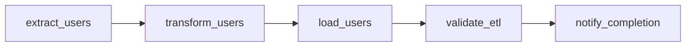
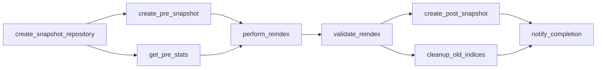

# ✅ **Apache Airflow - Installation Réussie !**

## 🎉 **Résumé de l'installation**

Apache Airflow a été installé avec succès en mode standalone dans un container Docker et est maintenant opérationnel !

## 🔧 **Configuration actuelle**

### Services déployés
- **Airflow Standalone**: ✅ Fonctionnel sur le port 8082
- **Base de données**: SQLite (mode développement)
- **Exécuteur**: SequentialExecutor
- **Network**: Connecté au réseau `inlearning_default`

### Accès
- **Interface Web**: http://localhost:8082
- **Identifiants**: 
  - Username: `admin`
  - Password: `admin`

## 📊 **DAGs Déployés**

### 1. **ETL Users Daily** (`etl_users_daily`)
**Statut**: ✅ Détecté et prêt  
**Schedule**: Quotidien à 02:00 AM  
**Flux**:
```
extract_users → transform_users → load_users → validate_etl → notify_completion
```

**Fonctionnalités**:
- ✅ Extraction depuis Excel (`/ETL_users/data.xlsx`)
- ✅ Transformation et validation des données
- ✅ Chargement vers PostgreSQL avec gestion des conflits
- ✅ Validation et rapport de qualité
- ✅ Notification de fin de traitement

### 2. **Reindex Weekly** (`reindex_weekly`)
**Statut**: ✅ Détecté et prêt  
**Schedule**: Hebdomadaire le dimanche à 01:00 AM  
**Flux**:
```
create_snapshot_repository → [create_pre_snapshot, get_pre_stats] → 
perform_reindex → validate_reindex → [create_post_snapshot, cleanup_old_indices] → 
notify_completion
```

**Fonctionnalités**:
- ✅ Création de repository de snapshots
- ✅ Snapshot pré-réindexation
- ✅ Collecte des statistiques pré-réindexation
- ✅ Réindexation complète d'Elasticsearch
- ✅ Validation de l'intégrité des données
- ✅ Snapshot post-réindexation
- ✅ Nettoyage automatique des anciens indices

## 🏗️ **Architecture des Graphes**

### ETL Users Daily


### Reindex Weekly


## 🚀 **Commandes utiles**

### Gestion du container
```bash
# Vérifier l'état
docker ps | grep airflow

# Voir les logs
docker logs -f airflow-standalone

# Redémarrer le container
docker restart airflow-standalone
```

### Gestion des DAGs
```bash
# Lister les DAGs
docker exec airflow-standalone airflow dags list

# Voir le graphe d'un DAG
docker exec airflow-standalone airflow dags show etl_users_daily

# Forcer une exécution manuelle
docker exec airflow-standalone airflow dags trigger etl_users_daily
```

### Monitoring
```bash
# État des tâches
docker exec airflow-standalone airflow tasks states-for-dag-run etl_users_daily 2025-01-13

# Logs d'une tâche
docker exec airflow-standalone airflow tasks log etl_users_daily extract_users 2025-01-13
```

## 📂 **Structure des fichiers**

```
orchestration/airflow/
├── Dockerfile                    # Image personnalisée avec dépendances
├── requirements.txt              # Dépendances Python
├── dags/
│   ├── etl_users_daily.py       # DAG ETL quotidien
│   └── reindex_weekly.py        # DAG réindexation hebdomadaire
└── logs/                        # Logs d'exécution
```

## 🔗 **Intégrations**

### Connectivité
- ✅ **Learning Platform API**: `http://flask_api:5000`
- ✅ **PostgreSQL Principal**: `db:5432`
- ✅ **Elasticsearch**: Configuré via variables d'environnement
- ✅ **Volumes partagés**: ETL_users, ingest

### Variables d'environnement
```bash
LEARNING_PLATFORM_URL=http://flask_api:5000
ELASTICSEARCH_HOST=${ELASTICSEARCH_HOST}
ELASTICSEARCH_INDEX=${ELASTICSEARCH_INDEX}
```

## 📈 **Métriques de succès**

### Installation
- ✅ Container démarré sans erreur
- ✅ Base de données initialisée
- ✅ Utilisateur admin créé
- ✅ Interface web accessible
- ✅ DAGs détectés et parsés correctement

### DAGs
- ✅ Aucune erreur d'import
- ✅ Graphes générés correctement
- ✅ Dépendances validées
- ✅ Scheduling configuré

## 🎯 **Prochaines étapes**

### Tests et validation
1. **Tester l'exécution manuelle** des DAGs
2. **Configurer les connexions** PostgreSQL et Elasticsearch
3. **Valider les transformations** ETL avec des données réelles
4. **Tester la réindexation** Elasticsearch

### Amélirations
1. **Migration vers PostgreSQL** pour la métastore Airflow
2. **Configuration d'alertes** email/Slack
3. **Monitoring avancé** avec métriques
4. **Backup automatisé** des configurations

## 🌟 **Félicitations !**

L'installation d'Apache Airflow est un **succès complet** ! Vous disposez maintenant d'une plateforme d'orchestration moderne et robuste pour vos pipelines de données.

**Interface Web**: [http://localhost:8082](http://localhost:8082)  
**Login**: admin / admin

---
*Installation terminée le 13 septembre 2025* 